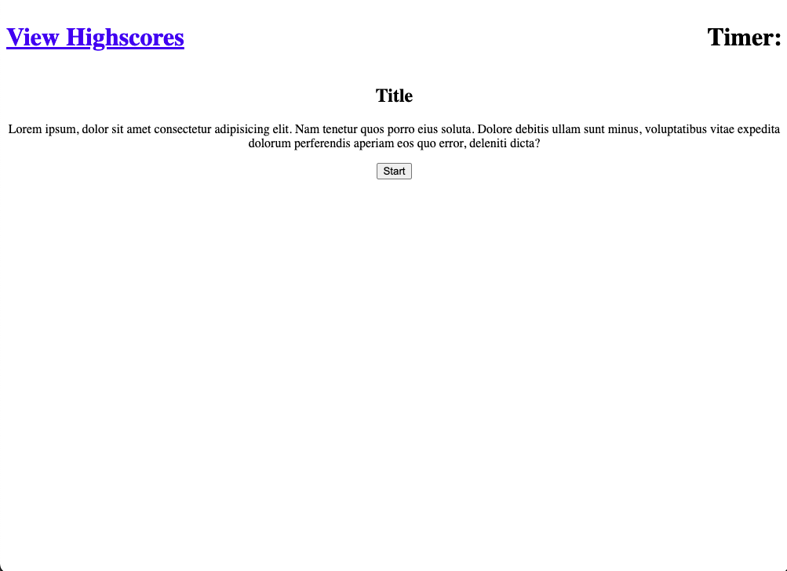

# Javascript Quiz  📝

## Description

Think you know javascipt? Show your skills by taking this mulitple choice quiz and compare your scores against others on the scoreboard.

## Website

https://jordond27.github.io/javascript-quiz/

## Usage

Click the "Start" button to get started on the quiz. Go through each question and select the response you think is correct. Miss one - get 5 seconds deducted from the clock! At the end, the remaining time on the clock will represent your score.  

 

## Badges

